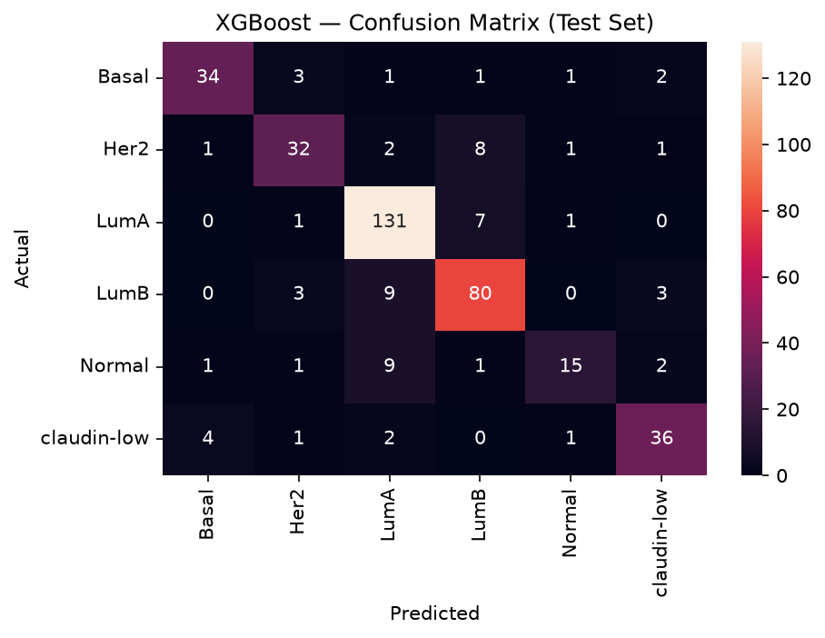
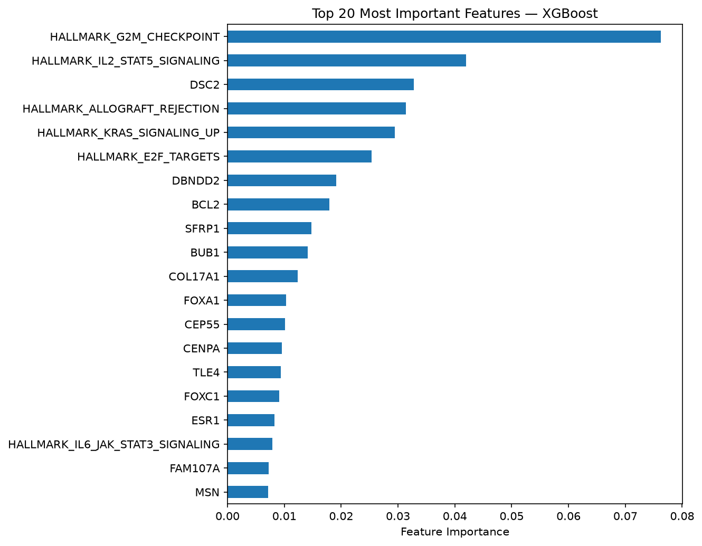

# ClinSTRAT — Multimodal Breast Cancer Subtype Classifier

An end-to-end machine learning pipeline that predicts breast cancer molecular subtype (6-class) by integrating clinical pathology data with microarray gene expression from the [METABRIC](https://www.nature.com/articles/nature10983) dataset (Nature 2012/2016).

**[Try the live app](https://clinstrat-b7hrmfcfeue7feh9evqb4d.streamlit.app)** — upload a patient data CSV and get an instant subtype prediction with confidence scores.

## Results

| Metric | Score |
|---|---|
| Accuracy | 83% |
| Macro F1 | 0.79 |
| Cohen's Kappa | 0.778 |

Confusion Matrix


Evaluated on a held-out test set (20% split, never seen during training). Misclassifications cluster along biologically related subtype pairs (LumA↔LumB, Her2↔LumB) rather than randomly — evidence the model is learning real tumor biology, not noise.

## What it does

- Integrates **2,509 patients'** clinical pathology records with **20,385-gene** microarray expression data
- Engineers a multimodal feature set: KNN-imputed clinical variables, top 500 ANOVA-selected differentially expressed genes, and 50 ssGSEA-derived Hallmark pathway enrichment scores
- Benchmarks Random Forest, SVM, and XGBoost classifiers
- Catches and corrects a target-leakage bug (`INTCLUST` — METABRIC's own subtype system leaking into the model)
- Serves predictions through an interactive Streamlit app

Feature Importance


## Pipeline

```
01_data_preprocessing.ipynb      Clinical data cleaning, leakage-column removal, KNN imputation
02_microarray_data_processing.ipynb   Gene expression processing, DEG selection, ssGSEA pathway scoring
03_sql_merge.ipynb               SQL (SQLite) join of clinical + genomic feature tables
04_modeling.ipynb                Model training, leakage fix, evaluation, artifact export
```

## Running locally

```bash
pip install -r requirements.txt
python -m streamlit run app.py
```

Place the trained model artifacts (`clinstrat_model.pkl`, `clinstrat_scaler.pkl`, `clinstrat_features.pkl`, `clinstrat_label_encoder.pkl`) inside a `models/` folder before running.

## Tools

Python, pandas, numpy, scikit-learn, XGBoost, gseapy (ssGSEA), SQLite, Streamlit, seaborn/matplotlib, joblib

## Data source

[METABRIC](https://www.cbioportal.org/study/summary?id=brca_metabric) via cBioPortal — publicly available breast cancer clinical + genomic dataset.
